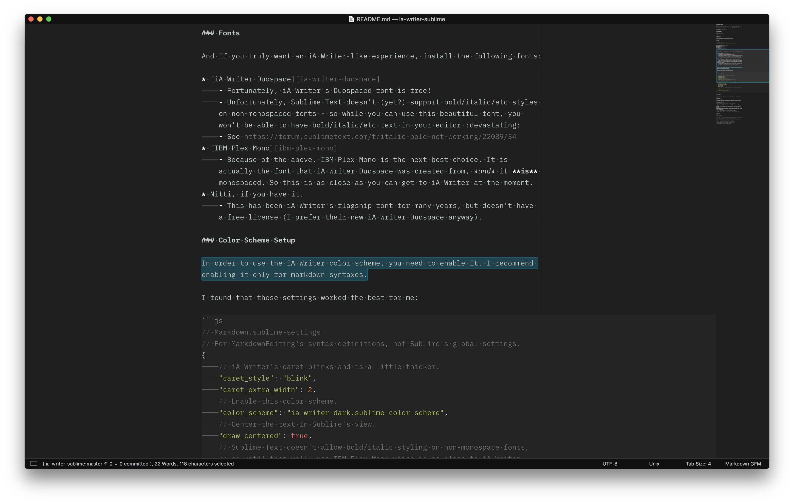

# iA Writer Sublime

I like the aesthetics of [iA Writer][ia-writer] but I cannot live without Sublime Text's amazing features and speed. So this project is an attempt to being iA's looks and experience as much as possible into Sublime Text.



### Features

Why Sublime Text over iA Writer?

* The raw performance of Sublime Text
	- Sublime is easy on memory, and blazingly fast
	- Over the years, there have been several updates to iA Writer which cause it to hang, pause, or just eat CPU
* Proper syntax highlighting of fenced code blocks<sup>§</sup>
* The excellent text-editing experience of Sublime Text
	- multiple cursors
	- selection logic
	- plugins/extensions
	- minimap
	- customisation
	- ...need I go on?
* See [Sublime Text's website](https://www.sublimetext.com/)

And, when you install this package, you get the beauty of iA Writer in Sublime Text!

<sup>§</sup>: requires installing [MarkdownEditing][markdown-editing]

## Installation

Clone this repository into your packages directory:

```bash
# You can find the Package directory by clicking in the menu and selecting:
# Preferences -> Browse Packages... This is where you should clone this repo.
cd path/to/sublime-text-3/Packages
git clone https://github.com/acheronfail/ia-writer-sublime.git
```

## Usage

### Additional Packages

I *highly* recommend you install the following packages:

* [MarkdownEditing][markdown-editing]
* [WordCount][word-count]
* [Pandoc][pandoc]
* [Table Editor][table-editor]

### Fonts

And if you truly want an iA Writer-like experience, install the following fonts:

* [iA Writer Duospace][ia-writer-duospace]
	- Fortunately, iA Writer's Duospaced font is free!
	- Unfortunately, Sublime Text doesn't (yet?) support bold/italic/etc styles on non-monospaced fonts - so while you can use this beautiful font, you won't be able to have bold/italic/etc text in your editor :devastating:
	- See https://forum.sublimetext.com/t/italic-bold-not-working/22089/34
* [IBM Plex Mono][ibm-plex-mono]
	- Because of the above, IBM Plex Mono is the next best choice. It is actually the font that iA Writer Duospace was created from, *and* it **is** monospaced. So this is as close as you can get to iA Writer at the moment.
* Nitti, if you have it.
	- This has been iA Writer's flagship font for many years, but doesn't have a free license (I prefer their new iA Writer Duospace anyway).

### Color Scheme Setup

In order to use the iA Writer color scheme, you need to enable it. I recommend enabling it only for markdown syntaxes.

I found that these settings worked the best for me:

```js
// Markdown.sublime-settings
// For MarkdownEditing's syntax definitions, not Sublime's global settings.
{
	// iA Writer's caret blinks and is a little thicker.
	"caret_style": "blink",
	"caret_extra_width": 2,
	// Enable this color scheme.
	"color_scheme": "ia-writer-dark.sublime-color-scheme",
	// Center the text in Sublime's view.
	"draw_centered": true,
	// Sublime Text doesn't allow bold/italic styling on non-monospace fonts,
	// so until then we'll use IBM Plex Mono which is as close to iA Writer
	// Duospace as we can get.
	"font_face": "IBM Plex Mono",
	"font_size": 16,
	"gutter": false,
	// If you have MarkdownEditing installed, you can enable several focus-like
	// options.
	"mde.keep_centered": true,
	"tab_size": 4,
	"translate_tabs_to_spaces": false
}
```

### UI Theme

This package doesn't include a UI Theme - I use Sublime's default Adaptive theme and it works for me. Although, performing the following really make it feel like writing in a prose editor:

* Hide the tabs `View` -> `Hide Tabs`
* Hide the sidebar `View` -> `Side Bar` -> `Hide Side Bar`

#### Roadmap

Further down the track, it might be nice to add support for the following:

* iA Writer Light Theme
* Some useful text commands/snippets related to writing
	- Date string generators
* Include an example `ia-writer.sublime-keymap` file to mimic iA Writer's commands
* Investigate a "focus mode" more like iA Writer's (using MarkdownEditing's options)
* Investigate iA Writer-like "syntax" highlighting (adjectives, nouns, adverbs, verbs, conjugations)
	- Not sure if this is even possible (maybe with regions?)
* Example uses of Pandoc to mimic iA Writer's export/preview functions
* UI Theme to mimic iA Writer even more

### Related

Sublime Text Build 3127 and above print `font face "iA Writer Duospace" is not monospace, disabling bold and italic to prevent text reflow`, unfortunately this isn't something that is supported at the moment. [Sublime Developer **wbond** also mentions](https://forum.sublimetext.com/t/proportional-fonts-lose-italic-bold-syntax-highlighting/10245/10?u=acheronfail):

> As far as I understand it, this is designed this way on purpose. I doubt it will change.

* https://ia.net/topics/in-search-of-the-perfect-writing-font/
* https://ia.net/writer/
* https://github.com/iaolo/iA-Fonts
* https://forum.sublimetext.com/t/italic-bold-not-working/22089/34?u=acheronfail
* https://github.com/SublimeTextIssues/Core/issues/279
* https://forum.sublimetext.com/t/how-to-enable-bold-and-italic-for-not-monospace-font/34008
* http://hypertext.net/2011/06/mimic-writer-aesthetic/

### License

[MIT](./LICENSE)

[ia-writer]: https://www.google.com.au/search?q=ia+writer&ie=utf-8&oe=utf-8&client=firefox-b-ab&gfe_rd=cr&dcr=0&ei=YK-jWsKyJdHN8gfstJmoDA
[markdown-editing]: https://github.com/SublimeText-Markdown/MarkdownEditing
[table-editor]: https://github.com/vkocubinsky/SublimeTableEditor
[word-count]: https://github.com/titoBouzout/WordCount
[pandoc]: https://github.com/tbfisher/sublimetext-Pandoc
[ia-writer-duospace]: https://github.com/iaolo/iA-Fonts
[ibm-plex-mono]: https://github.com/IBM/plex
